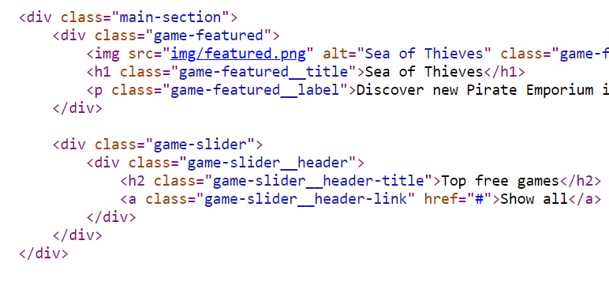

<p align="center"></p>
<h1 align="center">Uglify Classes : minify your web app</h1>

This package help you to minify your classnames to optimize size of your app. It's work with a simple CLI, and can be triggered after a build. **You can save up to 30% space** on CSS files and 20% on HTML files.

# How It Works
Script will analyze all your css files and detect all classnames. Then it will replace classes in all your assets.
You can choose between differents methods to generate minified versions of your classes (hash, random ...).



# Usage

install it as dev dependencies :
```shell
npm install uglify-classes --save-dev
```

Then, use it after a build (in your package.json) :
```json
"scripts": {
    "build": "... && uglify-classes <options>"
},
```

You can also use it without package.json by install it globally :
```shell
npm install -g uglify-classes
```

Then, use it in your terminal :
```shell
uglify-classes <options>
```

By default, it will replace all your files in dist folder. You can change this by adding a `--src` option.

# Methods

* Index (recommanded): It will generate a small unique index for each classname.
* Hash: It will generate a hash for each classname.
* Random: It will generate a unique random string for each classname.

# Options

Argument name | Default value | Description
--------------|---------------|-------------------
`--src <path>` | `dist/**/*` | Glob path to your source files.
`--method <method>` | `index` | Method to generate minified classnames. You can choose between `index` (default), `hash` or `random`. You need to specify a size for theses 2 methods. eg. `--method hash:6`.
`--prefix` | `None` | Prefix of classes you want to transform.
`--suffix` | `None` | Suffix of classes you want to transform.
`--prepend` | `_` | Prefix for transformed classes. NB: Make sure the new classname is valid.
`--append` | `None`| Suffix for transformed classes.

## License

Copyright (c) 2021 Arno Cellarier

This software is released under the terms of the MIT License.
See the [LICENSE](LICENSE) file for further information.
